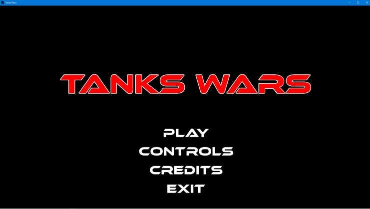
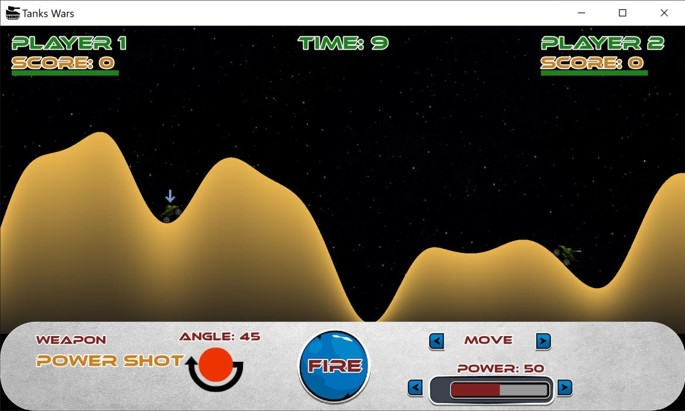

# Tank_Wars

## SFML_BOX2D Pocket Tanks Clone

Tank Wars “The Ultimate One-on-One Artillery Game” is the 2 player fast-paced artillery game that is simple to learn, and fun to master. Bury your opponent in a mound of dirt or assail him with a barrage of bullets. Pocket Tanks features modified physics and the ability to move the tank in fully destructible, randomly generated terrain.

> Code written in Visual Studio 2019 with SFML [2.5.1] and BOX2D (a physics engine).

## Usage

1. Open `Tank_Wars.sln` in Visual Studio (having C++17 compilant compiler)
2. Build the project in x64 Release configuration.

## License

This project is licensed under the MIT License - see the [LICENSE](LICENSE) file for details.
